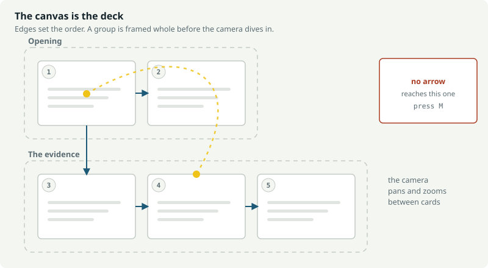
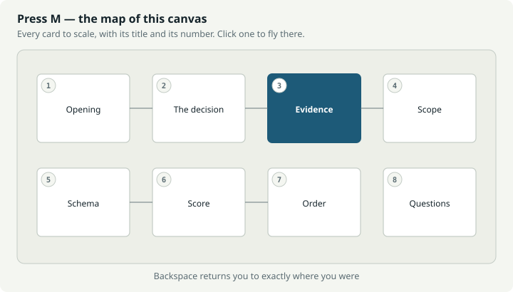
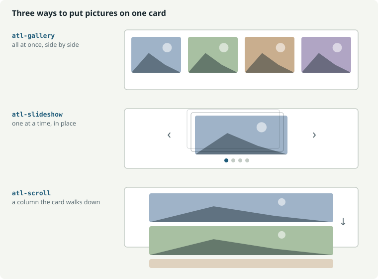

# Atlas Presenter

Turn an Obsidian **Canvas** into a presentation. Not a stack of slides — a camera
flying across a map of your notes.

Advanced Slides gives you one markdown file split by `---`. Atlas Presenter gives
you the canvas you already drew: cards keep their positions, edges become the
running order, groups become sections, and you can leave the path at any moment
and come back.



---

## Install

### Into a vault on this machine

```powershell
npm install
npm run vaults                       # lists the vaults Obsidian knows about
npm run install:vault                # builds, then installs
npm run install:vault -- -WithDemo   # and copies the demo decks in
```

The script reads Obsidian's own vault list, so you rarely type a path. Then enable
**Atlas** in **Settings → Community plugins**.

### From a release

Download `atlas-presenter-x.y.z.zip`, unzip into `<vault>/.obsidian/plugins/`. You
should end up with `<vault>/.obsidian/plugins/atlas-presenter/main.js`.

### With BRAT

Install **BRAT**, then *Add a beta plugin for testing* and paste this repo's URL.
Tags must be bare version numbers (`0.1.0`, never `v0.1.0`).

---

## Presenting

`Ctrl+Shift+P`, the ribbon icon, or right-click a canvas in the file explorer.
**With a card selected, the deck opens on that card**; with nothing selected it
starts at the beginning.

| Key | |
|---|---|
| `→` `Space` `PageDown` | Reveal, then the album, then scroll, then the next card |
| `←` `PageUp` | Back, the same way |
| **`M`** | The map of this canvas — click any card to fly to it |
| **`G`** | Obsidian's graph view of the whole vault |
| `Backspace` | Return from a jump, or one level out of a peeked note |
| `O` | Zoom out to the whole map |
| `Home` `End` | First and last card |
| `B` | Blank the screen — attention on the room, not the slide |
| `N` | Note something against the card on screen |
| `W` | Write the session up now |
| `P` | Open the presenter window on your second screen |
| `Enter` | Dive into the sub-deck on this card |
| `E` | Export the deck to one standalone HTML file |
| `F` | Fullscreen |
| `Esc` | Close the map or the note, then leave the deck |

Clicking the right two-thirds advances, the left third goes back. Clicking a
control inside a card never advances the slide.

---

## How a canvas becomes a deck

| Canvas | Presentation |
|---|---|
| Card | A slide |
| Card position and size | Where the camera goes and how far it zooms |
| Edge | The path from one card to the next |
| Edge label starting with a number | Forces the running order |
| Group | A section — framed whole before diving in, named on the map |
| Card with no edges | Still on the map, reachable by jumping |
| Card colour | Mirrored on the map |



Traversal is depth-first: a branch is told to its end before the next begins. The
start is the card with outgoing edges and none incoming, or any card containing
`#start`. A canvas with no edges presents in reading order.

---

## Writing cards

Everything below is written on the canvas. Nothing needs a setting turned on, and
**no CSS ever goes in a card** — so a card is still a readable, shareable note.

### Markdown

Rendered through Obsidian itself, so wikilinks, embeds, Mermaid and Dataview all
work.

| | |
|---|---|
| `+++` on its own line | A reveal — `→` shows the next block before moving on |
| `%%…%%` | Speaker notes. Never drawn on the slide; optionally shown under it |
| `[[A note]]` | Click while presenting to read the whole note over the deck |
| `![[picture.png]]` | Images, video and audio embeds |
| `![[drawing.excalidraw]]` | Excalidraw drawings, rendered by that plugin |
| A very long card | Scrolls a screenful per press, then moves on |

### Pictures



Three layouts, all taking the same markup:

```html
<div class="atl-gallery">   <!-- all at once, side by side in a grid -->
<div class="atl-slideshow"> <!-- one at a time, in place, with dots -->
<div class="atl-scroll">    <!-- a column the card scrolls through -->
  
  
</div>
```

A slide show has dots, arrows, swipe (any direction) and five transitions. `→`
steps through it before leaving the card.

### Styling hooks, with no CSS in the card

| Hook | Selector |
|---|---|
| A line of bare tags — `#title #dark` | `.atl-tag-title`, `.atl-tag-dark` |
| `cssclasses:` frontmatter on a note | that class |
| The enclosing group | `[data-group="the-evidence"]` |

The tag line is stripped before rendering, so it never reaches the slide.

### HTML, when you want full control

````
```slide-html
<style> .hero { display: grid; place-items: center; } </style>
<div class="hero">Anything you like</div>
```
````

It renders into a shadow root, so a card's CSS cannot leak. `<script>` runs, so a
card can hold a toggle, a chart or an animation. A card that animates should stop
when off camera:

Two things are already in scope for you: **`root`**, the card's own shadow root,
and **`host`**, the card element. Look things up through `root` — `document` sees
a different tree and will find nothing.

```js
const chart = root.querySelector('#chart');

// A card that animates should stop when it is off camera.
host.addEventListener('atlas:enter', start);
host.addEventListener('atlas:leave', stop);
```

Anything that throws is printed **on the card**, so a broken script says so
rather than failing quietly.

A `.html` file dropped on the canvas behaves the same way. `note.md#Heading`
cards present just that section.

---

## The `#deck` card

One card, tagged `#deck`, is the deck's title block. **It is never presented** and
never appears on the map.

```
#deck

theme: Atlas/Theme.css
logo: Assets/client.png
accent: #1D5A78
transition: slide

### Northwind Depot — controls plan
**Sam Avery** · {section} · {date}
```

Anything that is not a `key: value` line is the header, **rendered as markdown**.
Wrap a note to yourself in `%%…%%` and it is ignored, the same as a speaker note
— otherwise it would end up on screen.
Every key becomes a token — `{title}`, plus built-in `{deck}` `{section}` `{n}`
`{total}` `{date}`.

These keys override the plugin settings **for this canvas alone**, so a client
deck and an internal deck can differ entirely with nothing in settings:

`theme:` `logo:` `logo corner:` `logo height:` `accent:` `colour:` `image:`
`dim:` `align:` `fit:` `transition:` `header on:` `header position:`
`variant:` `advance:`

`advance: 8s` runs the deck by itself for an unattended screen — a lobby,
a stand. Any keypress stops it, because someone has arrived.

---

## Theming

Point **Settings → Background → Theme stylesheet** at a `.css` file in your vault.
It applies only while presenting — open the same card as a note and there is no
styling anywhere in it.

Four layers, later winning: Obsidian's theme → the plugin's `styles.css` → your
theme file → a `slide-html` card's own `<style>`. Your theme reaches inside HTML
cards too.

```css
.atl-overlay { --atl-accent: #1D5A78; --atl-inactive: 0.2; }
.atl-node:not(.atl-node-group) { background: #E6E9E1; }  /* see below */
.atl-node.is-active { }
.atl-node.atl-tag-title .atl-body { }
.atl-node[data-color="1"] { }        /* canvas colours 1–6 */
.atl-group-label { }                  /* the section name on the map */
.atl-body, .atl-hud, .atl-header { }
```

> **A group is also a `.atl-node`.** Styling `.atl-node` with a background paints
> a panel over the cards inside every group. Use `:not(.atl-node-group)`.

`demo/Atlas/Theme.css` is a commented, working example.

---

## Settings

| Section | |
|---|---|
| **Starting a presentation** | The shortcut, and a button to Obsidian's hotkey pane |
| **Camera** | Flight duration, section overviews, padding, contain/cover, maximum zoom |
| **Background** | Theme / colour / vault image with dimming, theme stylesheet, accent, off-camera card opacity |
| **Logo** | Any vault image, corner, height, opacity |
| **Slide shows** | Transition, contain/cover |
| **On screen** | Header line and where it shows, section titles, card alignment, speaker notes, next-card title, progress rail, timer |
| **Chrome** | Bottom bar, counter, video autoplay |
| **Writing cards** | The full authoring reference, with copyable snippets |

Settings are read when a deck **starts** — change them, then present.

---

## The demo

`npm run install:vault -- -WithDemo` copies one folder into the vault:

```
Atlas/
  1 · Start here.canvas     the rules, in the smallest deck that shows them
  2 · Themed deck.canvas    #title #section #quote #stat #dark #split #full
  3 · A real deck.canvas    a full plan: HTML slides and an animated card
  4 · Everything.canvas     a talk that happens to use every feature
  5 · Cheat sheet.canvas    every feature *with the syntax that produces it*
  Theme.css                 a commented example theme
  Assets/                   the slides, pictures and audio the decks point at
```

Start with **1**, present **5** when you want to look something up, and read
**4** to see what a finished deck feels like. They are built on an invented
project, so everything in them is safe to copy.

---

## One map, several talks

Tag a card to leave it out of a shorter version:

| Tag | Meaning |
|---|---|
| `#skip-exec` | Left out of the **exec** talk, in every other one |
| `#only-exec` | Appears in the **exec** talk and nowhere else |

Run **Present this canvas as…** and pick. The list is built from the tags the
cards already carry, so there is nothing to declare first; the `#deck` card can
name a default with `variant:`. Traversal walks *through* an omitted card to its
children, so leaving one out never severs the chain.

---

## Export

Press **`E`** while presenting, or run **Export the running deck to a single HTML
file**. You get one `.html` in your vault: the cards as they stand, every image,
video and audio file inlined as a data URI, and a small camera with the same
keys. It opens in any browser — no Obsidian, no network, no plugin.

Scripts are dropped from the export, so an interactive card renders but does not
run.

**For PDF, print it.** The exported file carries a print stylesheet: one card per
landscape page, the camera and the bottom bar hidden. Open it in a browser and
print to PDF. That keeps the deck a deck on screen and gives you pages on paper,
without a second export path to maintain.

---

## The presenter window

Press **`P`**. Obsidian opens a second window showing what you need and the
audience does not: the current card, **its speaker note at a readable size**, the
section you are in, what is coming next, the elapsed time and the clock, and
Back / Next buttons.

Drag it to your laptop screen and put the deck on the projector. Arrow keys work
in either window and drive the same deck.

Speaker notes are collected whether or not the on-screen panel is enabled, so
turning that off leaves the presenter window fully fed.

---

## Notes, and minutes

Two different things share the word "note".

**Prepared notes** are `%%…%%` in a card. They never reach the screen. They show
under the card if you enable it, and always in the presenter window.

**Notes you take during the talk** are new. Press **`N`** and a box opens over the
deck, already focused. Type, press Enter, it closes. What you typed is attached
to **the card that was on screen**, with the time.

Press `N` on that card again and the box comes back **with what you wrote in it**,
cursor at the end — so a second thought adds a line rather than starting a blank
note you cannot see. One card holds one note, kept at the time you first made it
so the write-up stays in order. Clear the box and save to delete it. The Remark
button in the bar is outlined when the card you are on already has one.

Leaving the deck writes it all up as one note in `Meetings/`:

```markdown
# Northwind Depot — 11 September 2026

14:02–14:38 · 24 cards · exec

Deck: [[Northwind Depot]]

## Why the code
### The join key
%%the prepared note%%
> 14:07 — Sam asked whether v6 changed this. Check and come back.

## Actions
- [ ] Re-run the v6 comparison before Thursday
```

Cards appear **in the order you actually visited them**, detours through the map
included. A card nobody wrote anything about is left out. Any line you type
beginning `- [ ]` is gathered into **Actions** at the end.

**`W`**, or the *Write up* button in the bar, opens the session for review: every
card that carries anything, in the order you visited it, each one **editable in
place**. Fix a typo, add the thing you meant to say, watch the action count
change — then **Create the note**, and it opens behind the deck.

Editing there writes into the same store the cards use, so pressing `N` on a card
afterwards shows what you changed. *Keep presenting* closes the review and
changes nothing.

Leaving the deck writes the note directly, without the review.

The folder is **Settings → Notes and minutes → Where minutes are filed**
(`Meetings` by default), along with whether leaving writes at all, what gets
appended to each action, and whether actions name the card they came from.

---

## Sub-decks

Drop a `.canvas` on a canvas and the card draws **that canvas to scale** — its
cards, groups and edges in miniature — so you can see how big the detour is
before taking it. Press **`Enter`** to present it.

The parent is hidden, not torn down: `Esc` comes back to the same card, with the
same history and the same remarks still gathering.

---

## Developing

`npm run dev` watches and rebuilds; the installer drops a `.hotreload` marker, so
with the **Hot Reload** plugin your changes apply without restarting.

```
src/
  main.ts              commands, hotkey, ribbon, canvas selection
  settings.ts          the settings tab and the authoring reference
  types.ts             canvas format, scene model, settings
  canvas/parse.ts      .canvas JSON, rects, group containment
  canvas/path.ts       edges -> running order, the #deck card
  present/presentation.ts  the deck: keys, chrome, stops
  present/camera.ts    pan, zoom, the arc between distant cards
  present/render.ts    cards -> DOM, media, reveals, styling hooks
  present/slideshow.ts the album inside a card
  present/minimap.ts   M — this canvas, drawn to scale
  present/browse.ts    G — the built-in vault graph
  present/peek.ts      reading a note without leaving the deck
```

Release: `npm version patch && git push --follow-tags`.
